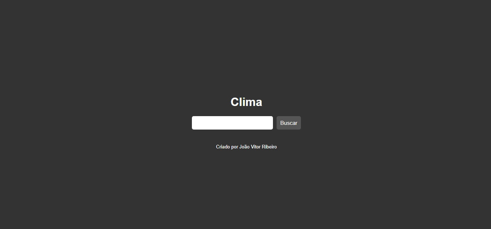
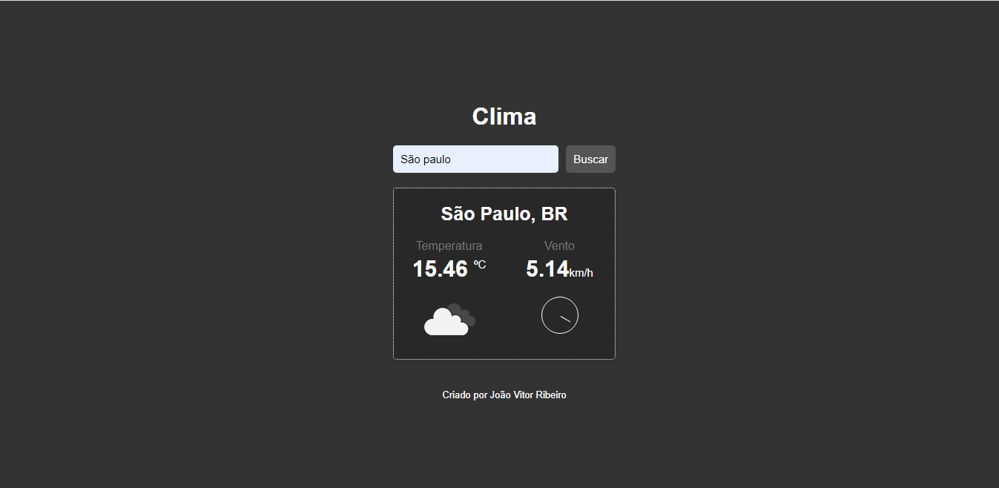

# 💻  Sobre o Projeto:
Este é um desafio desenvolvido durante o módulo de Java script do curso oferecido pela B7web, com o objetivo de evoluir a construção individual do aluno.Neste projeto foi usado uma API para mostra o clima de determinado local do mundo.Nesta página foram utilizadas apenas as tecnologia HTML5,CSS3 e Java Script.
 
# 🛠 Tecnologias utilizadas:

    <ul>
        <li>HTML</li>
        <li>CSS</li>
        <li>JavaScript</li>
    </ul>

# ⚙️ Funcionalidades:
<li>Na primeira seção da página, os usuários serão apresentados a uma barra de pesquisa que deve ser preenchida com um local no mundo  </li>
<li>Após escolher o local e clicar em buscar, será apresentado diversas informações meteorológicas como a temperatura,a direção do vento e a velociade do vento.</li>

# 🎨 Pré-visualização :
## Apresentação da barra de pesquisa

## Informações meteorológicas :

# 🦸 Autor:

 
<a href="https://www.linkedin.com/in/jo%C3%A3o-vitor-ribeiro-dias-339a56258/" target="_blank">João Vitor RIbeiro Dias</a>
